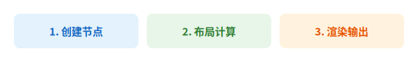

# Core Concepts

## Architecture Overview

The LatticeSVG rendering pipeline has three stages:

```
Style Parsing         Layout Solving        SVG Rendering
┌──────────┐    ┌──────────┐    ┌──────────┐
│ CSS dicts │ →  │ GridSolver│ →  │ Renderer │ → SVG / PNG
│ → computed│    │ → box model│   │ → drawsvg │
└──────────┘    └──────────┘    └──────────┘
```

<figure markdown="span">
  { loading=lazy }
  <figcaption>Three-stage pipeline: Style Parsing → Layout Solving → SVG Rendering</figcaption>
</figure>

## Node Tree

LatticeSVG uses a **node tree** to describe document structure. Every node is a subclass of `Node`:

- **`GridContainer`** — Container node, arranges children using CSS Grid
- **`TextNode`** — Leaf node, displays text content
- **`ImageNode`** — Leaf node, embeds raster images
- **`SVGNode`** — Leaf node, embeds SVG content
- **`MplNode`** — Leaf node, embeds Matplotlib figures
- **`MathNode`** — Leaf node, renders LaTeX formulas

```python
# Node tree example
page = GridContainer(style={...})          # root container
├── TextNode("Title")                      # child 1
├── GridContainer(style={...})             # nested container
│   ├── ImageNode("photo.png")             # grandchild
│   └── TextNode("Caption")
└── TextNode("Footer")                     # child 3
```

## Style System

### Declarative Styles

All styles are passed as Python dicts with CSS-compatible property names:

```python
style = {
    "width": "400px",
    "padding": "16px",
    "font-size": "14px",
    "color": "#333333",
    "background-color": "#ffffff",
    "grid-template-columns": ["1fr", "1fr"],
}
```

### Style Inheritance

Consistent with CSS, some properties inherit from parent nodes (e.g., `color`, `font-size`, `font-family`), while box model properties (e.g., `padding`, `margin`) do not.

### ComputedStyle

Each node holds a `ComputedStyle` object responsible for:

1. **Parsing raw values** — Converting `"16px"` to `16.0`
2. **Expanding shorthands** — Expanding `"padding": "10px 20px"` to four directions
3. **Inheritance** — Inheritable properties taken from parent
4. **Defaults** — Unspecified properties use registry defaults

## Layout Algorithm

### CSS Grid Solving

`GridSolver` implements the complete CSS Grid Level 1 layout algorithm:

1. **Track template parsing** — Parse `grid-template-columns` / `grid-template-rows`
2. **Item placement** — Position items via `row`/`col`/`area` or auto-placement
3. **Track sizing** — Handle fixed, percentage, `fr`, `auto`, `min-content`, `max-content`, `minmax()`
4. **Alignment** — Apply `justify-items`, `align-items`, `justify-self`, `align-self`
5. **Box model** — Compute `border-box`, `padding-box`, `content-box` for each node

### Box Model

After layout, each node has three rectangles (`Rect`):

```
┌─────────────────────────── border-box ──┐
│ border                                  │
│  ┌──────────────────── padding-box ──┐  │
│  │ padding                           │  │
│  │  ┌──────────── content-box ────┐  │  │
│  │  │                             │  │  │
│  │  │     content area            │  │  │
│  │  │                             │  │  │
│  │  └─────────────────────────────┘  │  │
│  └───────────────────────────────────┘  │
└─────────────────────────────────────────┘
```

The default `box-sizing` is `border-box`, consistent with modern CSS practice.

## Rendering Pipeline

`Renderer` traverses the laid-out node tree, generating SVG elements for each node:

1. **Background** — Solid colors, linear gradients, radial gradients
2. **Borders** — Independent color/width/style per side, dashed and dotted support
3. **Border radius** — Independent radius per corner
4. **Content** — Text glyphs, embedded images, SVG fragments, math formulas
5. **Visual effects** — Shadows, opacity, transforms, filters, clip-path

Output formats:

| Method | Output | Notes |
|---|---|---|
| `render(node, path)` | `.svg` file | Also returns `Drawing` object |
| `render_to_drawing(node)` | `Drawing` object | In-memory SVG |
| `render_to_string(node)` | SVG string | For HTML embedding |
| `render_png(node, path)` | `.png` file | Requires `cairosvg` |

## Text Engine

LatticeSVG's text engine is built on FreeType:

- **Precise measurement** — Glyph-level width, height, baseline offset
- **Automatic line breaking** — Greedy algorithm for text wrapping
- **CJK support** — Character-level break opportunities for CJK scripts
- **Rich text** — HTML / Markdown markup → `TextSpan` → multi-style composition
- **Vertical text** — `writing-mode: vertical-rl` support
- **Font fallback** — Multi-family font chain lookup
- **Font embedding** — WOFF2 subsetting and embedding in SVG

## Next Steps

- 📐 [Grid Layout Tutorial](../tutorials/grid-layout.md) — Practice CSS Grid layout patterns
- 📖 [CSS Properties Reference](../reference/css-properties.md) — Browse all 63 supported properties
- 🔧 [API Reference](../reference/api/index.md) — Complete class and method documentation
