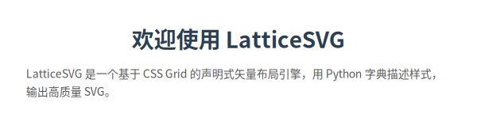
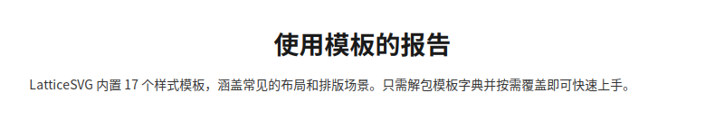

# Quick Start

This tutorial walks you through your first LatticeSVG layout in 5 minutes.

## Basic Workflow

LatticeSVG follows a three-step workflow:

1. **Create a `GridContainer`** — Define the layout container and its styles
2. **Add child nodes** — Use `.add()` to insert text, images, etc.
3. **Render output** — Call `Renderer` to generate SVG or PNG

## First Example

```python
from latticesvg import GridContainer, TextNode, Renderer

# Step 1: Create a page container
page = GridContainer(style={
    "width": "600px",
    "padding": "32px",
    "background-color": "#ffffff",
    "grid-template-columns": ["1fr"],  # single-column layout
    "gap": "16px",
})

# Step 2: Add content
page.add(TextNode("Welcome to LatticeSVG", style={
    "font-size": "28px",
    "font-weight": "bold",
    "color": "#2c3e50",
    "text-align": "center",
}))

page.add(TextNode(
    "LatticeSVG is a declarative vector layout engine based on CSS Grid. "
    "Describe styles with Python dicts, output high-quality SVG.",
    style={
        "font-size": "14px",
        "color": "#555555",
        "line-height": "1.6",
    },
))

# Step 3: Render
Renderer().render(page, "my_first_layout.svg")
```

<figure markdown="span">
  { loading=lazy }
  <figcaption>Rendered output</figcaption>
</figure>

## Two-Column Layout

```python
from latticesvg import GridContainer, TextNode, Renderer

page = GridContainer(style={
    "width": "600px",
    "padding": "24px",
    "background-color": "#f8f9fa",
    "grid-template-columns": ["1fr", "1fr"],  # two equal columns
    "gap": "16px",
})

page.add(TextNode("Left content", style={
    "padding": "16px",
    "background-color": "#ffffff",
    "border": "1px solid #dee2e6",
    "font-size": "14px",
}))

page.add(TextNode("Right content", style={
    "padding": "16px",
    "background-color": "#ffffff",
    "border": "1px solid #dee2e6",
    "font-size": "14px",
}))

Renderer().render(page, "two_columns.svg")
```

<figure markdown="span">
  { loading=lazy }
  <figcaption>Two-column equal-width layout</figcaption>
</figure>

## Using Built-in Templates

LatticeSVG provides 17 built-in style templates that can be used directly or partially overridden:

```python
from latticesvg import GridContainer, TextNode, Renderer, templates

page = GridContainer(style={
    **templates.REPORT_PAGE,  # 800px wide, white background, single column
})

page.add(TextNode("Report Title", style={
    **templates.TITLE,  # 28px bold centered
}))

page.add(TextNode("This is body text.", style={
    **templates.PARAGRAPH,  # 14px, line-height 1.6
}))

Renderer().render(page, "report.svg")
```

<figure markdown="span">
  { loading=lazy }
  <figcaption>Quickly create reports with built-in templates</figcaption>
</figure>

## Grid Placement

Use `row`, `col` parameters to precisely control child position in the grid:

```python
grid = GridContainer(style={
    "width": "400px",
    "grid-template-columns": ["1fr", "1fr", "1fr"],
    "grid-template-rows": ["auto", "auto"],
    "gap": "8px",
    "padding": "16px",
})

# Row 1, column 1, spanning 2 columns
grid.add(TextNode("Span two cols"), row=1, col=1, col_span=2)

# Row 1, column 3
grid.add(TextNode("Top right"), row=1, col=3)

# Row 2, spanning all 3 columns
grid.add(TextNode("Full width bottom"), row=2, col=1, col_span=3)

Renderer().render(grid, "grid_placement.svg")
```

## PNG Output

```python
renderer = Renderer()
renderer.render_png(page, "output.png", scale=2.0)  # 2x retina
```

!!! note "Requires `latticesvg[png]`"
    PNG output depends on CairoSVG. Run `pip install latticesvg[png]` first.

## Next Steps

- 📐 [Grid Layout Tutorial](../tutorials/grid-layout.md) — Master CSS Grid techniques
- 📝 [Text Typography Tutorial](../tutorials/text-typography.md) — Master text typesetting
- 🧩 [Node Types](../tutorials/node-types.md) — Learn about all available nodes
- 📖 [CSS Properties Reference](../reference/css-properties.md) — Browse all supported properties
