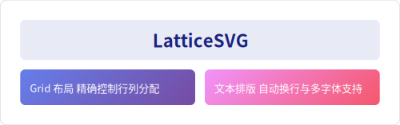
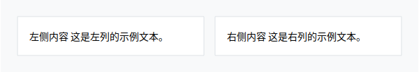

---
hide:
  - navigation
  - toc
---

<div class="hero" markdown>

# LatticeSVG

**Declarative Vector Layout Engine Powered by CSS Grid**

Describe layouts with Python dicts → Engine handles measuring, typesetting & rendering → Pixel-perfect SVG / PNG output

[Quick Start](getting-started/quickstart.md){ .md-button .md-button--primary }
[API Reference](reference/api/index.md){ .md-button }

</div>

<figure markdown="span">
  { loading=lazy }
  <figcaption>LatticeSVG rendering preview</figcaption>
</figure>

---

<div class="feature-grid" markdown>

<div class="feature-card" markdown>

### :material-grid: CSS Grid Layout

Full CSS Grid Level 1 implementation — fixed tracks, `fr` flexible units, `minmax()`, `repeat()`, named areas, auto-placement algorithm, all at your fingertips.

</div>

<div class="feature-card" markdown>

### :material-format-text: Precise Text Typesetting

FreeType-based glyph-level measurement with automatic line breaking, CJK typesetting, justification, rich text markup, vertical writing, and auto-hyphenation.

</div>

<div class="feature-card" markdown>

### :material-puzzle: Multiple Node Types

`TextNode`, `ImageNode`, `SVGNode`, `MplNode` (Matplotlib), `MathNode` (LaTeX formulas) — freely combine and nest them.

</div>

<div class="feature-card" markdown>

### :material-palette: Complete Visual Styling

63 CSS properties: box model, border-radius, border styles, gradient backgrounds, shadows, transforms, filters, clip-path, opacity.

</div>

<div class="feature-card" markdown>

### :material-file-document: Declarative API

All configuration via Python `dict` with CSS-compatible property names. No new DSL to learn — your CSS knowledge transfers directly.

</div>

<div class="feature-card" markdown>

### :material-image-multiple: SVG & PNG Output

Vector SVG by default, optional high-resolution PNG via CairoSVG. Supports WOFF2 font subsetting and embedding.

</div>

</div>

---

## Minimal Example

```python
from latticesvg import GridContainer, TextNode, Renderer

# 1. Create a Grid container
page = GridContainer(style={
    "width": "600px",
    "padding": "24px",
    "grid-template-columns": ["1fr", "1fr"],
    "gap": "16px",
    "background-color": "#ffffff",
})

# 2. Add child nodes
page.add(TextNode("Hello", style={"font-size": "24px", "color": "#2c3e50"}))
page.add(TextNode("World", style={"font-size": "24px", "color": "#e74c3c"}))

# 3. Render output
Renderer().render(page, "hello.svg")
```

<figure markdown="span">
  { loading=lazy }
  <figcaption>Rendered output of the code above</figcaption>
</figure>

---

## Installation

```bash
pip install latticesvg

# For PNG output
pip install latticesvg[png]

# For auto-hyphenation
pip install latticesvg[hyphens]
```

!!! info "System Dependencies"
    LatticeSVG requires the FreeType library installed on your system. Most Linux distributions and macOS come with it pre-installed.
    Windows users please see the [Installation Guide](getting-started/installation.md).

---

## Project Status

| Metric | Data |
|---|---|
| Version | v0.1.0 |
| License | MIT |
| Python | ≥ 3.8 |
| Core Code | ~8,900 lines |
| Tests | 352 test functions |
| Demos | 50 example scripts |
