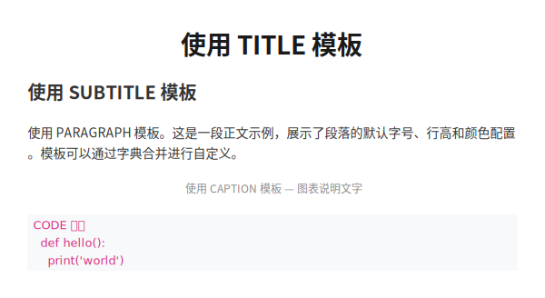
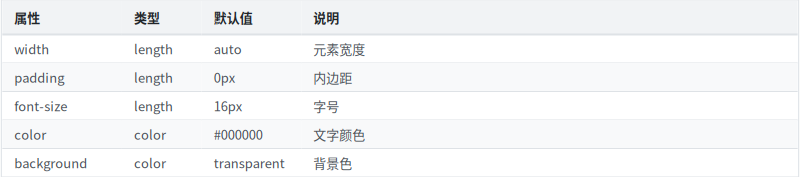
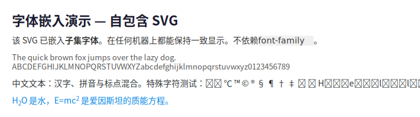

# 高级用法

本章介绍 LatticeSVG 的高级功能和最佳实践。

## 内置模板系统

LatticeSVG 提供 17 个预定义样式模板，可以直接使用或作为基础覆盖：

```python
from latticesvg import templates

# 直接使用
page = GridContainer(style=templates.REPORT_PAGE)

# 覆盖部分属性
page = GridContainer(style={
    **templates.REPORT_PAGE,
    "width": "1200px",  # 覆盖默认的 800px
    "padding": "40px",
})
```

<figure markdown="span">
  { loading=lazy }
  <figcaption>内置模板系统效果预览</figcaption>
</figure>

### 布局模板

| 模板 | 用途 |
|---|---|
| `REPORT_PAGE` | 800px 单列页面 |
| `TWO_COLUMN` | 两列等宽 |
| `THREE_COLUMN` | 三列等宽 |
| `SIDEBAR_LAYOUT` | 240px 侧边栏 + 弹性主区域 |
| `CHART_CONTAINER` | 2×2 图表网格 |

### 排版模板

`HEADER`, `FOOTER`, `TITLE`, `SUBTITLE`, `H1`~`H3`, `PARAGRAPH`, `CAPTION`, `CODE`

### 视觉模板

`CARD`, `HIGHLIGHT_BOX`

## 表格 API

`build_table()` 是构建表格的便捷函数：

```python
from latticesvg.templates import build_table
from latticesvg import Renderer

table = build_table(
    headers=["名称", "类型", "默认值"],
    rows=[
        ["width", "length", "auto"],
        ["padding", "length", "0px"],
        ["color", "color", "#000000"],
        ["font-size", "length", "16px"],
    ],
    col_widths=["150px", "100px", "1fr"],
    stripe_color="#f8f9fa",  # 斑马纹
)

Renderer().render(table, "table.svg")
```

<figure markdown="span">
  { loading=lazy }
  <figcaption>build_table() 生成的表格效果</figcaption>
</figure>

### 自定义表格样式

```python
table = build_table(
    headers=["Product", "Price", "Stock"],
    rows=[["Widget A", "$9.99", "142"], ["Widget B", "$19.99", "58"]],
    header_style={
        "background-color": "#2c3e50",
        "color": "#ffffff",
        "font-size": "14px",
    },
    cell_style={
        "font-size": "13px",
        "padding": "10px 16px",
    },
)
```

## PNG 输出

### 基本用法

```python
from latticesvg import Renderer

renderer = Renderer()
renderer.render_png(page, "output.png", scale=2.0)  # 2x 分辨率
```

### 高 DPI 输出

`scale` 参数控制输出分辨率倍数。对于打印品质，建议使用 `scale=3.0` 或更高。

## 字体嵌入

将使用的字体子集化并嵌入 SVG，使其在任何环境下都能正确显示：

```python
renderer = Renderer()

# SVG 文件中嵌入字体
renderer.render(page, "portable.svg", embed_fonts=True)

# 字符串中也可以嵌入
svg_string = renderer.render_to_string(page, embed_fonts=True)
```

<figure markdown="span">
  { loading=lazy }
  <figcaption>嵌入字体后的可移植 SVG</figcaption>
</figure>

!!! info "字体子集化"
    LatticeSVG 只嵌入文档中实际使用的字形（WOFF2 格式），不会嵌入完整字体，
    从而保持合理的文件大小。需要安装 `fonttools` 库。

## 无文件渲染

### 获取 Drawing 对象

```python
drawing = renderer.render_to_drawing(page)
# drawing 是 drawsvg.Drawing 对象，可以进一步操作
```

### 获取 SVG 字符串

```python
svg_string = renderer.render_to_string(page)
# 适合嵌入 HTML 页面或传给其他处理工具
```

## 布局检查

布局完成后，可以检查每个节点的位置和尺寸：

```python
page.layout(available_width=800)

# 检查根节点
print(f"页面尺寸: {page.border_box.width} × {page.border_box.height}")

# 检查子节点
for i, child in enumerate(page.children):
    bb = child.border_box
    print(f"子节点 {i}: 位置=({bb.x}, {bb.y}), 尺寸={bb.width}×{bb.height}")

    cb = child.content_box
    print(f"  内容区: 位置=({cb.x}, {cb.y}), 尺寸={cb.width}×{cb.height}")
```

## min/max 宽高

```python
TextNode("自适应宽度", style={
    "min-width": "100px",
    "max-width": "400px",
    "min-height": "50px",
    "font-size": "14px",
})
```

## 最佳实践

### 样式复用

```python
# 定义共享样式
card_style = {
    "padding": "16px",
    "background-color": "#ffffff",
    "border": "1px solid #e0e0e0",
    "border-radius": "8px",
}

# 复用
grid.add(TextNode("卡片 1", style={**card_style, "color": "#333"}))
grid.add(TextNode("卡片 2", style={**card_style, "color": "#666"}))
```

### 嵌套布局

复杂页面通过嵌套 `GridContainer` 构建层次结构：

```python
page = GridContainer(style=templates.REPORT_PAGE)

# 头部区域
header = GridContainer(style={
    "grid-template-columns": ["auto", "1fr"],
    "gap": "16px",
    "align-items": "center",
})
header.add(ImageNode("logo.png", style={"width": "48px", "height": "48px"}))
header.add(TextNode("公司名称", style=templates.H1))
page.add(header)

# 内容区域
content = GridContainer(style={
    "grid-template-columns": ["2fr", "1fr"],
    "gap": "24px",
})
content.add(TextNode("主要内容..."))
content.add(TextNode("侧边栏..."))
page.add(content)
```

### 性能提示

1. **避免过深嵌套** — 3-4 层嵌套足以满足大多数需求
2. **复用 Renderer 实例** — 多次渲染时复用同一个 `Renderer()`
3. **合理使用字体嵌入** — 仅在需要跨环境显示时启用 `embed_fonts=True`
4. **提前指定宽度** — 为根容器指定明确的 `width` 避免默认值计算
