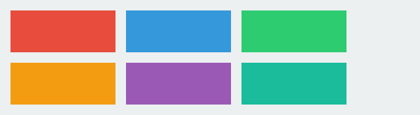
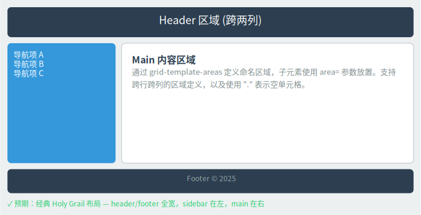
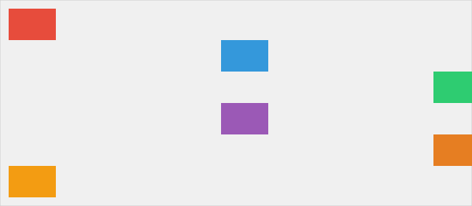
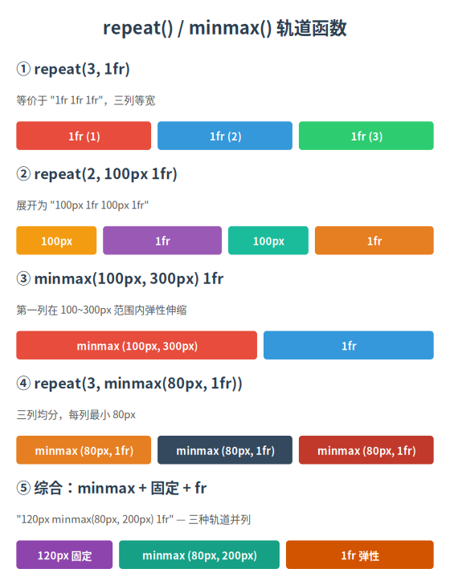
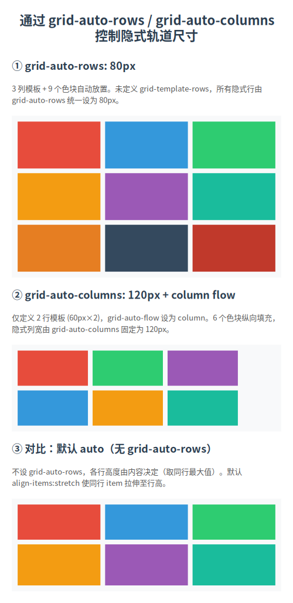

# Grid Layout

This tutorial covers CSS Grid layout techniques in LatticeSVG, from basics to advanced.

## Fixed Tracks

The simplest grid — specify fixed pixel widths:

```python
from latticesvg import GridContainer, TextNode, Renderer

grid = GridContainer(style={
    "width": "500px",
    "padding": "16px",
    "grid-template-columns": ["200px", "280px"],
    "gap": "12px",
    "background-color": "#f5f5f5",
})

grid.add(TextNode("200px wide", style={"background-color": "#e3f2fd", "padding": "12px"}))
grid.add(TextNode("280px wide", style={"background-color": "#fce4ec", "padding": "12px"}))

Renderer().render(grid, "fixed_grid.svg")
```

<figure markdown="span">
  { loading=lazy }
  <figcaption>Two-column grid with fixed pixel widths</figcaption>
</figure>

## Flexible Units (`fr`)

The `fr` unit distributes remaining space proportionally:

```python
grid = GridContainer(style={
    "width": "600px",
    "padding": "16px",
    "grid-template-columns": ["1fr", "2fr", "1fr"],  # 1:2:1 ratio
    "gap": "12px",
})
```

<figure markdown="span">
  { loading=lazy }
  <figcaption>fr units distribute space proportionally</figcaption>
</figure>

## Mixed Tracks

Combine fixed widths with flexible units:

```python
grid = GridContainer(style={
    "width": "800px",
    "padding": "16px",
    "grid-template-columns": ["240px", "1fr"],  # fixed sidebar + flexible main
    "gap": "24px",
})
```

<figure markdown="span">
  { loading=lazy }
  <figcaption>Fixed sidebar + flexible main area</figcaption>
</figure>

!!! tip "Classic Sidebar Layout"
    `["240px", "1fr"]` is the most common sidebar pattern. You can also use the
    built-in template `templates.SIDEBAR_LAYOUT`.

## Auto Placement

When `row`/`col` are not specified, children are auto-placed following `grid-auto-flow`:

```python
grid = GridContainer(style={
    "width": "600px",
    "grid-template-columns": ["1fr", "1fr", "1fr"],
    "gap": "8px",
    "padding": "16px",
})

# Auto-fills by row: 3 in row 1, 2 in row 2
for i in range(5):
    grid.add(TextNode(f"Item {i+1}", style={
        "padding": "12px",
        "background-color": "#e8eaf6",
        "text-align": "center",
    }))
```

<figure markdown="span">
  { loading=lazy }
  <figcaption>Auto-placement fills children by row</figcaption>
</figure>

## Spanning

Use `row_span` and `col_span` to make elements span multiple tracks:

```python
grid = GridContainer(style={
    "width": "500px",
    "grid-template-columns": ["1fr", "1fr", "1fr"],
    "grid-template-rows": ["auto", "auto", "auto"],
    "gap": "8px",
    "padding": "16px",
})

# Span 2 columns
grid.add(TextNode("Span 2 cols", style={
    "background-color": "#bbdefb",
    "padding": "16px",
    "text-align": "center",
}), row=1, col=1, col_span=2)

# Span 2 rows
grid.add(TextNode("Span 2 rows", style={
    "background-color": "#c8e6c9",
    "padding": "16px",
    "text-align": "center",
}), row=1, col=3, row_span=2)
```

<figure markdown="span">
  { loading=lazy }
  <figcaption>Elements spanning multiple tracks</figcaption>
</figure>

## Named Areas

Use `grid-template-areas` to define named regions, then place children with the `area` parameter:

```python
grid = GridContainer(style={
    "width": "600px",
    "padding": "16px",
    "grid-template-columns": ["200px", "1fr"],
    "grid-template-rows": ["auto", "1fr", "auto"],
    "grid-template-areas": '"header header" "sidebar main" "footer footer"',
    "gap": "8px",
})

grid.add(TextNode("Header", style={
    "background-color": "#2c3e50", "color": "#fff", "padding": "16px",
}), area="header")

grid.add(TextNode("Sidebar", style={
    "background-color": "#ecf0f1", "padding": "16px",
}), area="sidebar")

grid.add(TextNode("Main Content", style={
    "background-color": "#ffffff", "padding": "16px",
}), area="main")

grid.add(TextNode("Footer", style={
    "background-color": "#34495e", "color": "#ecf0f1",
    "padding": "12px", "text-align": "center",
}), area="footer")
```

<figure markdown="span">
  { loading=lazy }
  <figcaption>grid-template-areas named region layout</figcaption>
</figure>

## Alignment

### Container-Level Alignment

- `justify-items` — Horizontal alignment for all children (`start` | `center` | `end` | `stretch`)
- `align-items` — Vertical alignment for all children

### Item-Level Alignment

- `justify-self` — Override horizontal alignment for a single child
- `align-self` — Override vertical alignment for a single child

```python
grid = GridContainer(style={
    "width": "400px",
    "grid-template-columns": ["1fr", "1fr"],
    "gap": "12px",
    "padding": "16px",
    "justify-items": "center",
    "align-items": "center",
})
```

<figure markdown="span">
  { loading=lazy }
  <figcaption>Alignment example</figcaption>
</figure>

## `repeat()` and `minmax()`

Use `repeat()` to simplify repeated track definitions, and `minmax()` to set track size ranges:

```python
grid = GridContainer(style={
    "width": "800px",
    "padding": "16px",
    "grid-template-columns": "repeat(3, minmax(150px, 1fr))",
    "gap": "12px",
})
```

<figure markdown="span">
  { loading=lazy }
  <figcaption>repeat() and minmax() example</figcaption>
</figure>

## Auto Tracks

When children exceed explicitly defined tracks, `grid-auto-rows` and `grid-auto-columns` control implicit track sizes:

```python
grid = GridContainer(style={
    "width": "400px",
    "grid-template-columns": ["1fr", "1fr"],
    "grid-auto-rows": "80px",
    "gap": "8px",
    "padding": "16px",
})

for i in range(6):
    grid.add(TextNode(f"Cell {i+1}", style={
        "background-color": "#e0f7fa",
        "padding": "8px",
        "text-align": "center",
    }))
```

<figure markdown="span">
  { loading=lazy }
  <figcaption>Auto tracks example</figcaption>
</figure>

## Nested Grids

A `GridContainer` can be a child of another `GridContainer`:

```python
outer = GridContainer(style={
    "width": "800px",
    "padding": "24px",
    "grid-template-columns": ["1fr", "1fr"],
    "gap": "16px",
})

left_card = GridContainer(style={
    "padding": "16px",
    "background-color": "#ffffff",
    "border": "1px solid #e0e0e0",
    "grid-template-columns": ["1fr"],
    "gap": "8px",
})
left_card.add(TextNode("Card Title", style={"font-weight": "bold"}))
left_card.add(TextNode("Card content"))

outer.add(left_card)
```

<figure markdown="span">
  { loading=lazy }
  <figcaption>Nested GridContainer example</figcaption>
</figure>

## Gap Control

Use `column-gap` and `row-gap` independently:

```python
grid = GridContainer(style={
    "width": "600px",
    "grid-template-columns": ["1fr", "1fr", "1fr"],
    "column-gap": "24px",
    "row-gap": "8px",
    "padding": "16px",
})
```

!!! note "Shorthand"
    `gap` is shorthand for `row-gap` and `column-gap`. `"gap": "8px 24px"` is
    equivalent to `"row-gap": "8px"` + `"column-gap": "24px"`.
