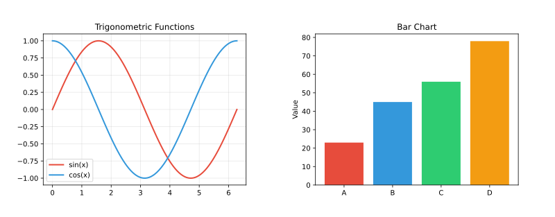
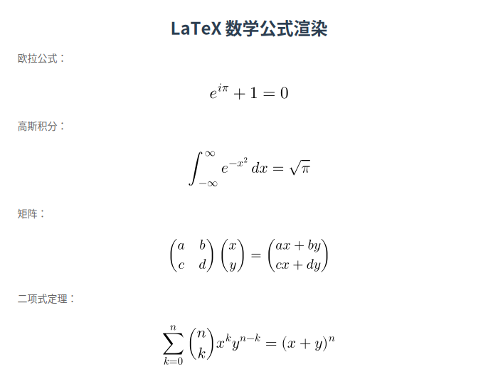
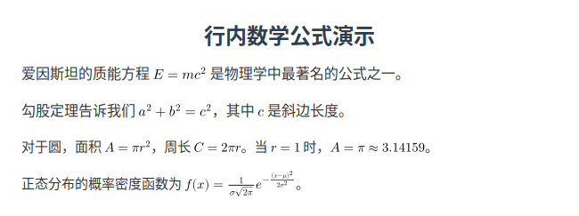
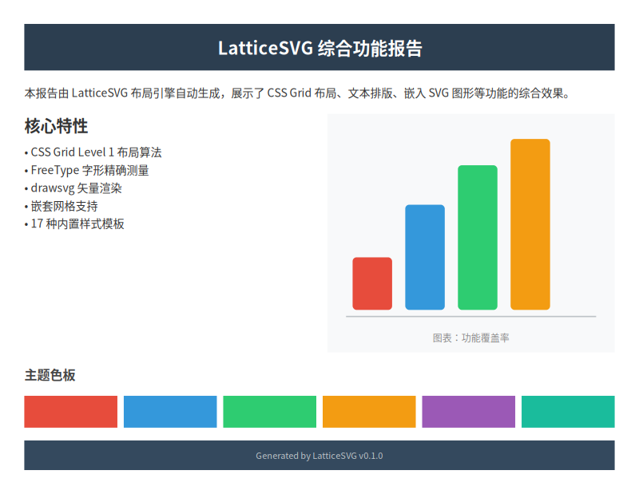

# 节点类型

LatticeSVG 提供 6 种节点类型，满足不同的内容需求。

## GridContainer

容器节点，使用 CSS Grid 排列子节点。所有布局都从 `GridContainer` 开始。

```python
from latticesvg import GridContainer

container = GridContainer(style={
    "width": "600px",
    "padding": "20px",
    "grid-template-columns": ["1fr", "1fr"],
    "gap": "16px",
    "background-color": "#ffffff",
})
```

详细的 Grid 布局用法请参阅 [Grid 布局教程](grid-layout.md)。

## TextNode

文本叶节点，显示文本内容并支持自动换行。

```python
from latticesvg import TextNode

# 简单文本
text = TextNode("Hello, World!", style={
    "font-size": "18px",
    "color": "#333333",
})

# 富文本（HTML 标记）
rich = TextNode(
    "这是 <b>加粗</b> 和 <i>斜体</i> 文本。",
    style={"font-size": "14px"},
    markup="html",
)

# 富文本（Markdown 标记）
md = TextNode(
    "这是 **加粗** 和 *斜体* 文本。",
    style={"font-size": "14px"},
    markup="markdown",
)
```

详细用法请参阅 [文本排版教程](text-typography.md) 和 [富文本教程](rich-text.md)。

## ImageNode

图片叶节点，嵌入光栅图片（PNG、JPEG 等）。

```python
from latticesvg import ImageNode

# 从文件路径加载
img = ImageNode("photo.png", style={
    "width": "300px",
    "height": "200px",
})

# 从 bytes 加载
with open("photo.png", "rb") as f:
    img = ImageNode(f.read(), style={"width": "300px"})

# 从 PIL Image 加载
from PIL import Image
pil_img = Image.open("photo.png")
img = ImageNode(pil_img, style={"width": "300px"})
```

### object-fit

控制图片在容器中的缩放方式：

```python
ImageNode("photo.png", style={
    "width": "200px",
    "height": "200px",
    "object-fit": "cover",     # 裁切填满
    # "contain"   — 完整显示，可能有留白
    # "fill"      — 拉伸填满（默认）
})
```

## SVGNode

嵌入 SVG 内容，可以从字符串或文件加载。

```python
from latticesvg import SVGNode

# 从 SVG 字符串
icon = SVGNode(
    '<svg viewBox="0 0 24 24"><circle cx="12" cy="12" r="10" fill="#4CAF50"/></svg>',
    style={"width": "48px", "height": "48px"},
)

# 从文件
logo = SVGNode("logo.svg", is_file=True, style={
    "width": "200px",
})

# 从 URL
remote = SVGNode("https://example.com/icon.svg", style={
    "width": "64px",
})
```

<figure markdown="span">
  { loading=lazy }
  <figcaption>SVGNode 嵌入矢量图标示例</figcaption>
</figure>

## MplNode

嵌入 Matplotlib 图表。传入一个 `matplotlib.figure.Figure` 对象。

```python
import matplotlib.pyplot as plt
from latticesvg import MplNode

fig, ax = plt.subplots(figsize=(4, 3))
ax.plot([1, 2, 3, 4], [1, 4, 2, 3])
ax.set_title("Sample Chart")

chart = MplNode(fig, style={
    "width": "400px",
})
```

<figure markdown="span">
  { loading=lazy }
  <figcaption>MplNode 嵌入 Matplotlib 图表</figcaption>
</figure>

!!! warning "注意"
    使用 `MplNode` 需要安装 Matplotlib（`pip install matplotlib`）。
    图表以 SVG 格式嵌入，保持矢量品质。

## MathNode

渲染 LaTeX 数学公式。使用 QuickJax（基于 MathJax v4）作为后端。

```python
from latticesvg import MathNode

# 显示模式公式
formula = MathNode(
    r"E = mc^2",
    style={"font-size": "24px"},
)

# 更复杂的公式
integral = MathNode(
    r"\int_{-\infty}^{\infty} e^{-x^2} dx = \sqrt{\pi}",
    style={"font-size": "20px"},
)

# 行内模式
inline = MathNode(
    r"\alpha + \beta = \gamma",
    display=False,
    style={"font-size": "16px"},
)
```

<figure markdown="span">
  { loading=lazy }
  <figcaption>MathNode 渲染 LaTeX 数学公式</figcaption>
</figure>

### 内联数学（在 TextNode 中）

在富文本中嵌入数学公式：

=== "HTML 标记"

    ```python
    TextNode(
        "爱因斯坦的质能方程 <math>E = mc^2</math> 是物理学最著名的公式之一。",
        markup="html",
    )
    ```

=== "Markdown 标记"

    ```python
    TextNode(
        "爱因斯坦的质能方程 $E = mc^2$ 是物理学最著名的公式之一。",
        markup="markdown",
    )
    ```

<figure markdown="span">
  { loading=lazy }
  <figcaption>在文本中嵌入数学公式</figcaption>
</figure>

## 组合示例

将多种节点类型组合在一个布局中：

```python
from latticesvg import GridContainer, TextNode, ImageNode, MathNode, Renderer, templates

page = GridContainer(style={
    **templates.REPORT_PAGE,
    "gap": "16px",
})

# 标题
page.add(TextNode("实验报告", style=templates.TITLE))

# 图片 + 说明
figure_area = GridContainer(style={
    "grid-template-columns": ["1fr"],
    "gap": "8px",
    "padding": "16px",
    "border": "1px solid #e0e0e0",
})
figure_area.add(ImageNode("experiment.png", style={"width": "100%"}))
figure_area.add(TextNode("图 1：实验装置", style=templates.CAPTION))
page.add(figure_area)

# 公式
page.add(MathNode(
    r"F = G \frac{m_1 m_2}{r^2}",
    style={"font-size": "20px"},
))

# 正文
page.add(TextNode("根据以上公式...", style=templates.PARAGRAPH))

Renderer().render(page, "report.svg")
```

<figure markdown="span">
  { loading=lazy }
  <figcaption>多种节点类型组合的报告页面</figcaption>
</figure>
