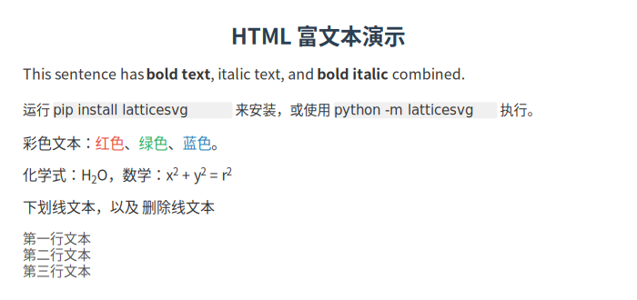
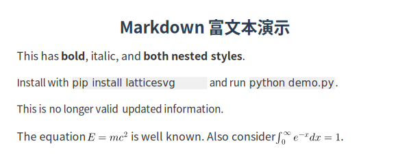

# 富文本与标记

LatticeSVG 支持在 `TextNode` 中使用 HTML 子集或 Markdown 语法实现富文本排版。

## HTML 标记

设置 `markup="html"` 启用 HTML 标记解析：

```python
from latticesvg import TextNode

text = TextNode(
    "这是 <b>加粗</b>、<i>斜体</i>、<b><i>粗斜体</i></b> 文本。",
    style={"font-size": "14px"},
    markup="html",
)
```

<figure markdown="span">
  { loading=lazy }
  <figcaption>HTML 标记富文本效果</figcaption>
</figure>

### 支持的 HTML 标签

| 标签 | 效果 | 示例 |
|---|---|---|
| `<b>`, `<strong>` | 加粗 | `<b>粗体</b>` |
| `<i>`, `<em>` | 斜体 | `<i>斜体</i>` |
| `<u>` | 下划线 | `<u>下划线</u>` |
| `<s>`, `<del>` | 删除线 | `<s>删除线</s>` |
| `<sub>` | 下标 | `H<sub>2</sub>O` |
| `<sup>` | 上标 | `E=mc<sup>2</sup>` |
| `<br>`, `<br/>` | 换行 | `第一行<br>第二行` |
| `<span>` | 内联样式 | `<span style="color:red">红色</span>` |
| `<math>` | 内联数学 | `<math>E=mc^2</math>` |
| `<code>` | 代码样式 | `<code>print()</code>` |

### 内联样式

`<span>` 标签支持 `style` 属性来设置内联样式：

```python
TextNode(
    '普通文本 <span style="color: #e74c3c; font-size: 18px">红色大号</span> 普通文本',
    markup="html",
)
```

支持的内联样式属性：

- `color` — 文字颜色
- `background-color` — 背景色
- `font-size` — 字号（px/pt）
- `font-family` — 字体族
- `font-weight` — 字重
- `font-style` — 字形
- `text-decoration` — 文本装饰

## Markdown 标记

设置 `markup="markdown"` 启用 Markdown 语法：

```python
text = TextNode(
    "这是 **加粗**、*斜体*、***粗斜体*** 文本。",
    style={"font-size": "14px"},
    markup="markdown",
)
```

<figure markdown="span">
  { loading=lazy }
  <figcaption>Markdown 标记富文本效果</figcaption>
</figure>

### 支持的 Markdown 语法

| 语法 | 效果 |
|---|---|
| `**text**` | 加粗 |
| `*text*` | 斜体 |
| `***text***` | 粗斜体 |
| `` `code` `` | 代码样式 |
| `~~text~~` | 删除线 |
| `$LaTeX$` | 内联数学公式 |

## 内联数学公式

### HTML 模式

使用 `<math>` 标签嵌入 LaTeX 公式：

```python
TextNode(
    "质能方程 <math>E = mc^2</math> 由爱因斯坦在 1905 年提出。"
    "其中 <math>E</math> 是能量，<math>m</math> 是质量，"
    "<math>c</math> 是光速。",
    markup="html",
    style={"font-size": "14px", "line-height": "1.8"},
)
```

### Markdown 模式

使用 `$...$` 语法嵌入 LaTeX 公式：

```python
TextNode(
    "质能方程 $E = mc^2$ 由爱因斯坦在 1905 年提出。"
    "其中 $E$ 是能量，$m$ 是质量，$c$ 是光速。",
    markup="markdown",
    style={"font-size": "14px", "line-height": "1.8"},
)
```

## TextSpan 数据结构

标记解析器将文本解析为 `TextSpan` 列表。每个 `TextSpan` 包含一段连续的同样式文本：

```python
from latticesvg.markup import parse_markup, parse_html, parse_markdown

spans = parse_markup("**bold** normal", "markdown")
# → [TextSpan(text="bold", font_weight="bold"),
#    TextSpan(text=" normal")]

spans = parse_html("<b>bold</b> <i>italic</i>")
# → [TextSpan(text="bold", font_weight="bold"),
#    TextSpan(text=" "),
#    TextSpan(text="italic", font_style="italic")]
```

## 富文本与排版的交互

富文本模式下，文本排版引擎会为每个 `TextSpan` 独立应用字体和样式，同时保持整体的折行和对齐逻辑：

```python
TextNode(
    "LatticeSVG 支持 <b>加粗</b>、<i>斜体</i>、"
    '<span style="color: #e74c3c">彩色</span>、'
    '<span style="font-size: 20px">大号</span> 混排，'
    "并保持自动折行。",
    markup="html",
    style={
        "font-size": "14px",
        "line-height": "1.8",
        "text-align": "justify",
    },
)
```

## 综合示例

```python
from latticesvg import GridContainer, TextNode, Renderer, templates

page = GridContainer(style={**templates.REPORT_PAGE, "gap": "16px"})

page.add(TextNode("富文本演示", style=templates.TITLE))

page.add(TextNode(
    "LatticeSVG 的标记系统支持在文本中嵌入 **各种样式** 和 *数学公式*。"
    "例如，著名的欧拉公式 $e^{i\\pi} + 1 = 0$ 将五个最重要的数学常数联系在一起。\n\n"
    "你还可以使用 ~~删除线~~ 和 `代码` 样式。",
    markup="markdown",
    style={**templates.PARAGRAPH, "line-height": "2.0"},
))

Renderer().render(page, "rich_text.svg")
```

<figure markdown="span">
  { loading=lazy }
  <figcaption>富文本与数学公式混排</figcaption>
</figure>
