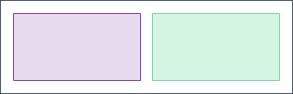
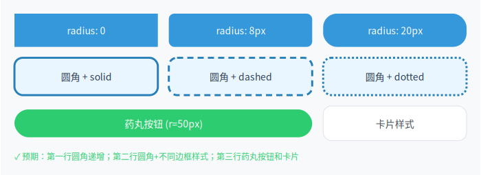
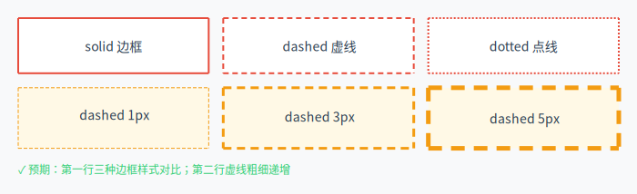
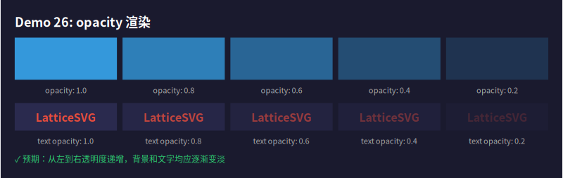
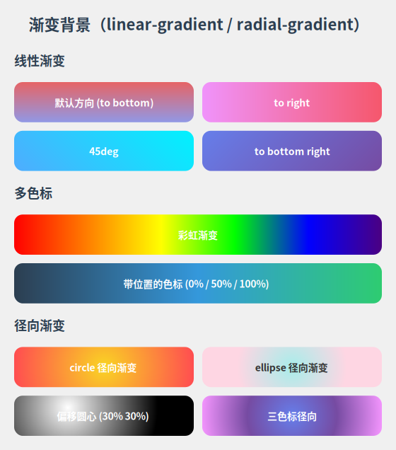
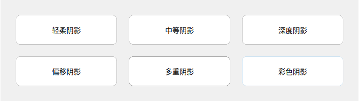
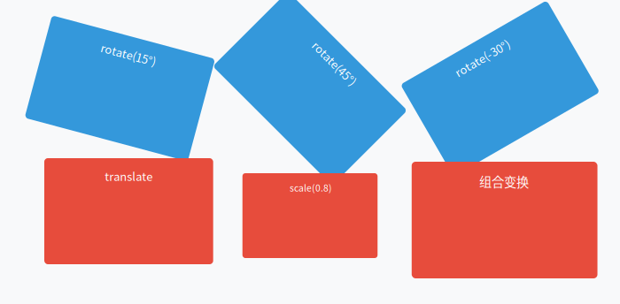
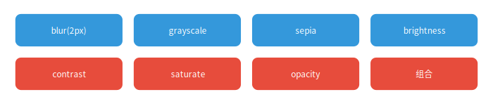
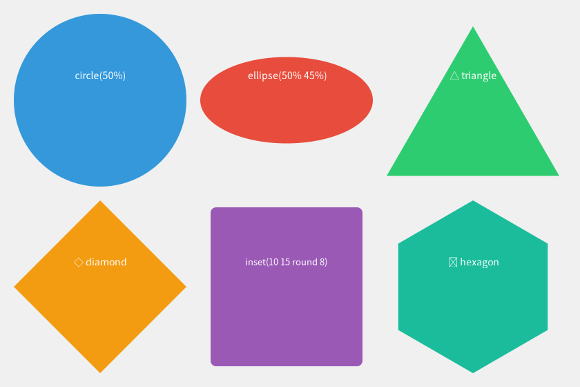

# 样式与视觉

LatticeSVG 支持丰富的 CSS 视觉样式属性。

## 盒模型

每个节点都有完整的盒模型：`margin`、`padding`、`border`。

```python
from latticesvg import GridContainer, TextNode, Renderer

card = GridContainer(style={
    "width": "300px",
    "margin": "20px",
    "padding": "16px",
    "border": "2px solid #3498db",
    "background-color": "#ffffff",
    "grid-template-columns": ["1fr"],
})

card.add(TextNode("带完整盒模型的卡片", style={"font-size": "14px"}))
```

<figure markdown="span">
  { loading=lazy }
  <figcaption>盒模型示例：margin、padding、border</figcaption>
</figure>

!!! info "box-sizing"
    默认 `box-sizing: border-box`，`width` 包含 padding 和 border。

### 独立方向设置

```python
style = {
    "padding-top": "8px",
    "padding-right": "16px",
    "padding-bottom": "8px",
    "padding-left": "16px",
    # 或使用简写
    "padding": "8px 16px",       # 上下 8px，左右 16px
    "padding": "8px 16px 12px",  # 上 8px，左右 16px，下 12px
}
```

## 圆角

```python
# 四角统一
TextNode("圆角卡片", style={
    "padding": "16px",
    "background-color": "#e3f2fd",
    "border-radius": "8px",
})

# 四角独立
TextNode("不对称圆角", style={
    "padding": "16px",
    "background-color": "#fce4ec",
    "border-top-left-radius": "20px",
    "border-top-right-radius": "4px",
    "border-bottom-right-radius": "20px",
    "border-bottom-left-radius": "4px",
})
```

<figure markdown="span">
  { loading=lazy }
  <figcaption>border-radius 均匀与独立圆角效果</figcaption>
</figure>

## 边框样式

支持 `solid`、`dashed`、`dotted` 三种边框样式，四边可独立设置：

```python
TextNode("虚线边框", style={
    "padding": "16px",
    "border": "2px dashed #e74c3c",
})

TextNode("混合边框", style={
    "padding": "16px",
    "border-top": "3px solid #2ecc71",
    "border-right": "2px dashed #3498db",
    "border-bottom": "1px dotted #9b59b6",
    "border-left": "2px solid #e67e22",
})
```

<figure markdown="span">
  { loading=lazy }
  <figcaption>多种边框样式：solid、dashed、dotted</figcaption>
</figure>

## 透明度

```python
TextNode("半透明文本", style={
    "opacity": "0.5",
    "font-size": "24px",
    "color": "#e74c3c",
})
```

<figure markdown="span">
  { loading=lazy }
  <figcaption>opacity 透明度效果</figcaption>
</figure>

## 渐变背景

### 线性渐变

```python
TextNode("线性渐变", style={
    "padding": "24px",
    "color": "#ffffff",
    "background": "linear-gradient(135deg, #667eea, #764ba2)",
})
```

### 径向渐变

```python
TextNode("径向渐变", style={
    "padding": "24px",
    "color": "#ffffff",
    "background": "radial-gradient(circle, #f093fb, #f5576c)",
})
```

<figure markdown="span">
  { loading=lazy }
  <figcaption>线性渐变与径向渐变</figcaption>
</figure>

## 阴影

```python
TextNode("带阴影的卡片", style={
    "padding": "20px",
    "background-color": "#ffffff",
    "border-radius": "8px",
    "box-shadow": "0 4px 12px rgba(0, 0, 0, 0.15)",
})

# 多重阴影
TextNode("多重阴影", style={
    "padding": "20px",
    "background-color": "#ffffff",
    "box-shadow": "0 2px 4px rgba(0,0,0,0.1), 0 8px 16px rgba(0,0,0,0.1)",
})
```

<figure markdown="span">
  { loading=lazy }
  <figcaption>box-shadow 单重与多重阴影</figcaption>
</figure>

## 变换

```python
TextNode("旋转", style={
    "padding": "16px",
    "background-color": "#e8eaf6",
    "transform": "rotate(5deg)",
})

TextNode("缩放", style={
    "transform": "scale(1.2)",
})

TextNode("多重变换", style={
    "transform": "rotate(-3deg) scale(0.9) translate(10px, 5px)",
})
```

<figure markdown="span">
  { loading=lazy }
  <figcaption>transform 旋转、缩放、平移效果</figcaption>
</figure>

## 滤镜

```python
# 模糊
TextNode("模糊效果", style={
    "filter": "blur(2px)",
})

# 灰度
ImageNode("photo.png", style={
    "filter": "grayscale(100%)",
    "width": "200px",
})

# 多重滤镜
ImageNode("photo.png", style={
    "filter": "brightness(1.2) contrast(1.1) saturate(1.3)",
    "width": "200px",
})
```

<figure markdown="span">
  { loading=lazy }
  <figcaption>CSS filter 滤镜效果</figcaption>
</figure>

## 裁剪路径

```python
# 圆形裁剪
ImageNode("avatar.png", style={
    "width": "100px",
    "height": "100px",
    "clip-path": "circle(50%)",
})

# 椭圆裁剪
ImageNode("photo.png", style={
    "width": "200px",
    "clip-path": "ellipse(40% 50% at 50% 50%)",
})

# 多边形裁剪
TextNode("六边形", style={
    "padding": "40px",
    "background-color": "#4caf50",
    "color": "#fff",
    "clip-path": "polygon(50% 0%, 100% 25%, 100% 75%, 50% 100%, 0% 75%, 0% 25%)",
})

# 圆角矩形裁剪
ImageNode("photo.png", style={
    "width": "200px",
    "clip-path": "inset(5% round 10px)",
})
```

<figure markdown="span">
  { loading=lazy }
  <figcaption>clip-path 圆形、多边形、圆角矩形裁剪</figcaption>
</figure>

## 轮廓

```python
TextNode("带轮廓的元素", style={
    "padding": "16px",
    "background-color": "#fff",
    "outline": "2px solid #2196f3",
    "outline-offset": "4px",
})
```

## 综合示例：Material 风格卡片

```python
card = GridContainer(style={
    "width": "320px",
    "padding": "0px",
    "background-color": "#ffffff",
    "border-radius": "12px",
    "box-shadow": "0 2px 8px rgba(0,0,0,0.12), 0 1px 3px rgba(0,0,0,0.08)",
    "overflow": "hidden",
    "grid-template-columns": ["1fr"],
    "gap": "0px",
})

# 渐变头部
card.add(TextNode("Feature Card", style={
    "padding": "24px",
    "background": "linear-gradient(135deg, #667eea, #764ba2)",
    "color": "#ffffff",
    "font-size": "20px",
    "font-weight": "bold",
}))

# 内容区
card.add(TextNode(
    "这是一个完整的 Material Design 风格卡片示例，"
    "展示了圆角、阴影、渐变等视觉效果的组合使用。",
    style={
        "padding": "16px 24px",
        "font-size": "14px",
        "color": "#555",
        "line-height": "1.6",
    },
))
```
