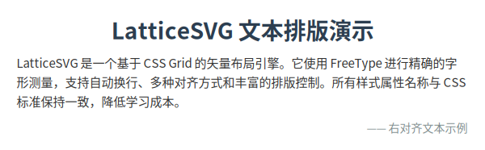
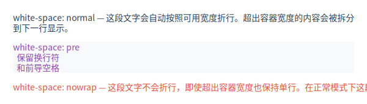
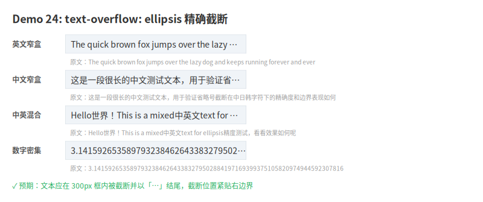
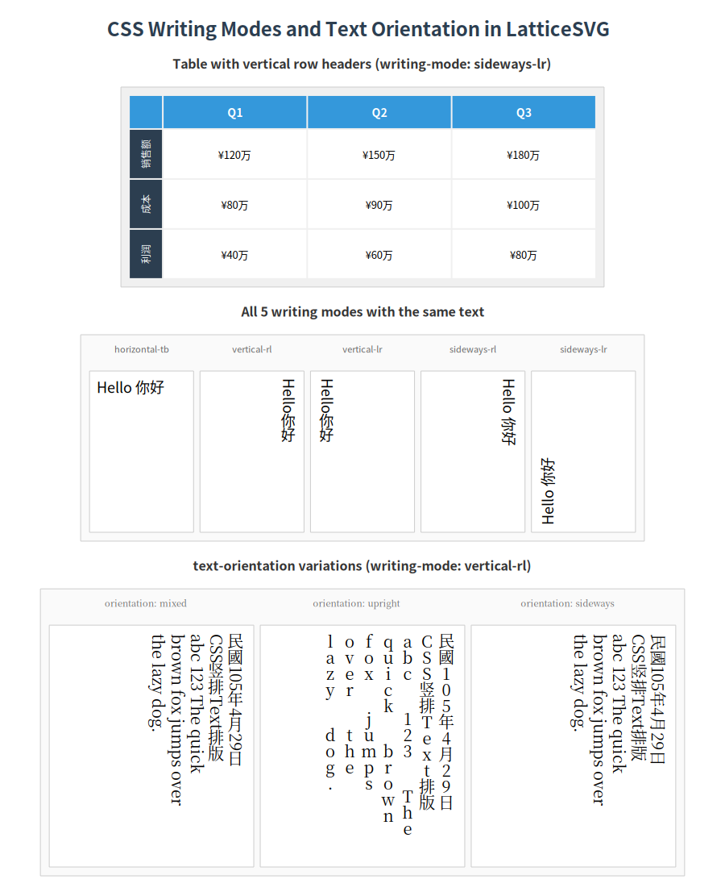
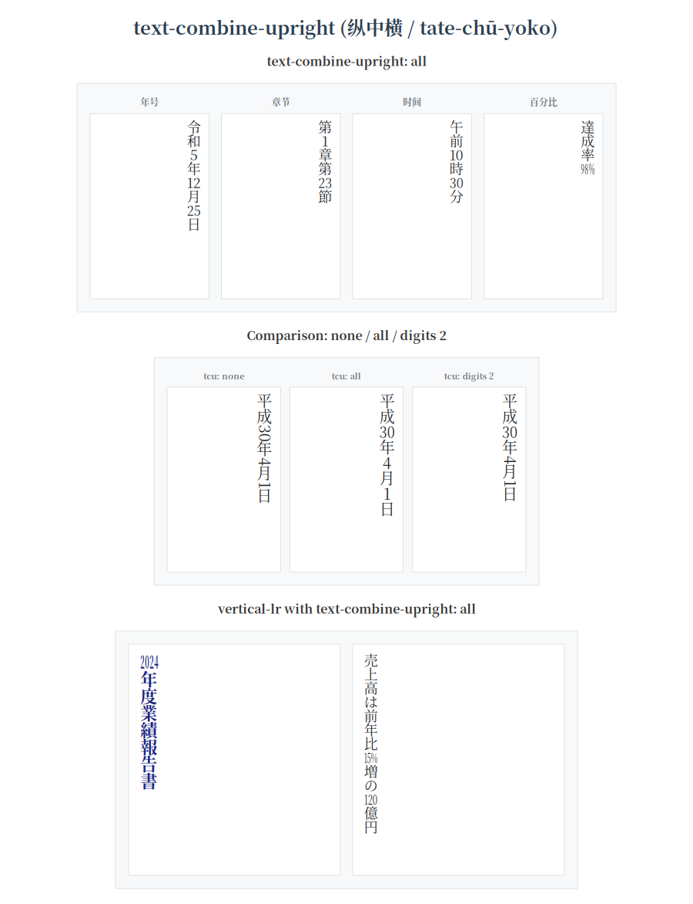
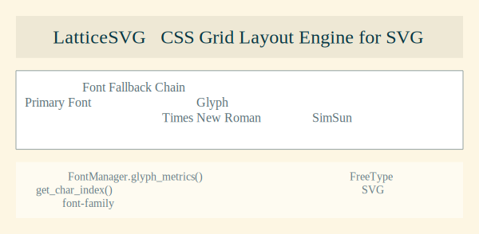

# Text & Typography

LatticeSVG provides a precise text typesetting engine built on FreeType.

## Basic Text

```python
from latticesvg import GridContainer, TextNode, Renderer

page = GridContainer(style={
    "width": "500px",
    "padding": "24px",
    "grid-template-columns": ["1fr"],
    "gap": "16px",
})

page.add(TextNode("This is basic text content.", style={
    "font-size": "16px",
    "color": "#333333",
    "line-height": "1.6",
}))

Renderer().render(page, "text_basic.svg")
```

<figure markdown="span">
  { loading=lazy }
  <figcaption>Basic text typesetting example</figcaption>
</figure>

## Font Control

### Font Family

`font-family` supports multiple fonts with fallback:

```python
TextNode("Hello 你好", style={
    "font-family": ["Helvetica", "Noto Sans SC", "sans-serif"],
    "font-size": "18px",
})
```

### Weight and Style

```python
TextNode("Bold Italic Text", style={
    "font-weight": "bold",
    "font-style": "italic",
    "font-size": "20px",
})
```

## Text Alignment

```python
TextNode("Left aligned", style={"text-align": "left"})       # default
TextNode("Centered", style={"text-align": "center"})
TextNode("Right aligned", style={"text-align": "right"})
TextNode("Justified text spread evenly.", style={"text-align": "justify"})
```

## Automatic Line Breaking

The engine automatically wraps text at appropriate positions:

- **Latin**: Break at spaces
- **CJK**: Character-level break opportunities
- **Mixed**: Automatic handling of mixed scripts

```python
page.add(TextNode(
    "LatticeSVG supports mixed CJK-Latin text with automatic line breaking. "
    "中英文混排自动折行示例。",
    style={"font-size": "14px", "line-height": "1.8"},
))
```

## White Space Handling

The `white-space` property controls how whitespace and newlines are handled:

| Value | Description |
|---|---|
| `normal` | Collapse whitespace, auto-wrap (default) |
| `nowrap` | Collapse whitespace, no auto-wrap |
| `pre` | Preserve whitespace and newlines |
| `pre-wrap` | Preserve whitespace, allow auto-wrap |
| `pre-line` | Collapse whitespace, preserve explicit newlines |

```python
TextNode("Line 1\n  Line 2\n    Line 3", style={
    "white-space": "pre",
    "font-family": "monospace",
    "font-size": "13px",
})
```

<figure markdown="span">
  { loading=lazy }
  <figcaption>white-space property comparison</figcaption>
</figure>

## Overflow Handling

### overflow-wrap

When a single word exceeds the container width:

```python
TextNode("Superlongwordwithoutanyspace", style={
    "overflow-wrap": "break-word",
    "font-size": "14px",
})
```

### Text Ellipsis

```python
TextNode("This is very long text that will be replaced with ellipsis.", style={
    "text-overflow": "ellipsis",
    "white-space": "nowrap",
    "overflow": "hidden",
    "font-size": "14px",
})
```

<figure markdown="span">
  { loading=lazy }
  <figcaption>Text ellipsis effect</figcaption>
</figure>

## Auto-Hyphenation

With `hyphens: auto`, the engine inserts hyphens at appropriate break points:

```python
TextNode(
    "Internationalization and standardization are important concepts.",
    style={
        "hyphens": "auto",
        "lang": "en",
        "font-size": "14px",
    },
)
```

!!! note "Requires `latticesvg[hyphens]`"
    Auto-hyphenation depends on Pyphen. Run `pip install latticesvg[hyphens]` first.

## Letter and Word Spacing

```python
TextNode("Letter Spacing", style={"letter-spacing": "2px"})
TextNode("Word Spacing Example", style={"word-spacing": "8px"})
```

## Vertical Text

Use `writing-mode` for vertical text layout:

```python
TextNode("竖排文本示例", style={
    "writing-mode": "vertical-rl",
    "text-orientation": "mixed",
    "font-size": "18px",
})
```

<figure markdown="span">
  { loading=lazy }
  <figcaption>Vertical text layout</figcaption>
</figure>

### text-combine-upright

Display short numbers/Latin text horizontally within vertical text:

```python
TextNode("令和6年12月25日", style={
    "writing-mode": "vertical-rl",
    "text-combine-upright": "digits 2",
    "font-size": "16px",
})
```

<figure markdown="span">
  { loading=lazy }
  <figcaption>text-combine-upright effect</figcaption>
</figure>

## Mixed Fonts

When text contains multiple scripts (Chinese + English + Japanese), FontManager automatically uses the font fallback chain to find available glyphs per character:

```python
TextNode("Hello 你好 こんにちは", style={
    "font-family": ["Helvetica", "Noto Sans SC", "Noto Sans JP"],
    "font-size": "18px",
})
```

<figure markdown="span">
  { loading=lazy }
  <figcaption>Multi-font fallback chain example</figcaption>
</figure>

## Line Height

`line-height` supports multiple formats:

```python
TextNode("Line height 1.6", style={"line-height": "1.6"})         # unitless multiplier (recommended)
TextNode("Line height 24px", style={"line-height": "24px"})       # pixel value
TextNode("Normal line height", style={"line-height": "normal"})   # equals 1.2
```
