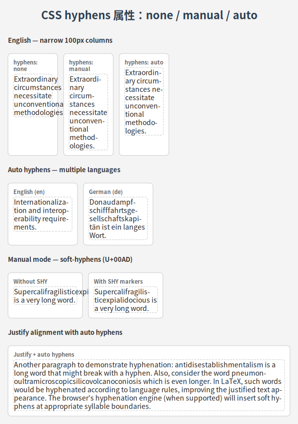

# 文本排版

LatticeSVG 提供基于 FreeType 的精确文本排版引擎，支持多种文本处理场景。

## 基础文本

```python
from latticesvg import GridContainer, TextNode, Renderer

page = GridContainer(style={
    "width": "500px",
    "padding": "24px",
    "grid-template-columns": ["1fr"],
    "gap": "16px",
})

page.add(TextNode("这是一段基础文本内容。", style={
    "font-size": "16px",
    "color": "#333333",
    "line-height": "1.6",
}))

Renderer().render(page, "text_basic.svg")
```

<figure markdown="span">
  { loading=lazy }
  <figcaption>基础文本排版示例</figcaption>
</figure>

## 字体控制

### 字体族

`font-family` 支持指定多个字体，按顺序回退：

```python
TextNode("Hello 你好", style={
    "font-family": ["Helvetica", "Noto Sans SC", "sans-serif"],
    "font-size": "18px",
})
```

### 字重与字形

```python
TextNode("Bold Italic Text", style={
    "font-weight": "bold",
    "font-style": "italic",
    "font-size": "20px",
})
```

## 文本对齐

```python
# 左对齐（默认）
TextNode("左对齐文本", style={"text-align": "left"})

# 居中
TextNode("居中文本", style={"text-align": "center"})

# 右对齐
TextNode("右对齐文本", style={"text-align": "right"})

# 两端对齐
TextNode("This is justified text that will be spread evenly.", style={
    "text-align": "justify",
})
```

## 自动折行

当文本超出容器宽度时，引擎会自动在合适的位置换行：

- **西文**：在空格处断行
- **CJK**：逐字符可断
- **mixed**：中英文混排自动处理

```python
page.add(TextNode(
    "LatticeSVG 支持中英文混排自动折行。"
    "This is a demonstration of mixed Chinese-English text with automatic line breaking.",
    style={"font-size": "14px", "line-height": "1.8"},
))
```

## 空白处理

`white-space` 属性控制空白符和换行的处理方式：

| 值 | 说明 |
|---|---|
| `normal` | 合并空白，自动换行（默认） |
| `nowrap` | 合并空白，不自动换行 |
| `pre` | 保留空白和换行 |
| `pre-wrap` | 保留空白，允许自动换行 |
| `pre-line` | 合并空白，保留显式换行 |

```python
TextNode("Line 1\n  Line 2\n    Line 3", style={
    "white-space": "pre",
    "font-family": "monospace",
    "font-size": "13px",
})
```

<figure markdown="span">
  { loading=lazy }
  <figcaption>white-space 属性效果对比</figcaption>
</figure>

## 溢出处理

### overflow-wrap

当单个单词超出容器宽度时：

```python
TextNode("Superlongwordwithoutanyspace", style={
    "overflow-wrap": "break-word",  # 允许词内断行
    "font-size": "14px",
})
```

### 文本省略

```python
TextNode("这是一段很长的文本，超出部分将被省略号替代。", style={
    "text-overflow": "ellipsis",
    "white-space": "nowrap",
    "overflow": "hidden",
    "font-size": "14px",
})
```

<figure markdown="span">
  { loading=lazy }
  <figcaption>文本省略号效果</figcaption>
</figure>

## 自动断词

启用 `hyphens: auto` 后，引擎会在合适的位置插入连字符断行：

```python
TextNode(
    "Internationalization and standardization are important concepts.",
    style={
        "hyphens": "auto",
        "lang": "en",  # 指定语言以选择正确的断词规则
        "font-size": "14px",
    },
)
```

<figure markdown="span">
  { loading=lazy }
  <figcaption>自动断词示例</figcaption>
</figure>

!!! note "需要安装 `latticesvg[hyphens]`"
    自动断词依赖 Pyphen 库，请先运行 `pip install latticesvg[hyphens]`。

## 字间距与词间距

```python
TextNode("L e t t e r  S p a c i n g", style={
    "letter-spacing": "2px",
    "font-size": "16px",
})

TextNode("Word   Spacing   Example", style={
    "word-spacing": "8px",
    "font-size": "16px",
})
```

## 竖排文本

使用 `writing-mode` 实现竖排文本：

```python
TextNode("竖排文本示例", style={
    "writing-mode": "vertical-rl",    # 从右到左竖排
    "text-orientation": "mixed",       # CJK 竖排，拉丁文旋转
    "font-size": "18px",
})
```

<figure markdown="span">
  { loading=lazy }
  <figcaption>竖排文本示例</figcaption>
</figure>

### 纵中横（text-combine-upright）

在竖排中，将短数字/拉丁文横排显示：

```python
TextNode("令和6年12月25日", style={
    "writing-mode": "vertical-rl",
    "text-combine-upright": "digits 2",  # 2 位以内数字横排
    "font-size": "16px",
})
```

<figure markdown="span">
  { loading=lazy }
  <figcaption>纵中横效果</figcaption>
</figure>

## 混合字体

当文本包含多种文字（如中文 + 英文 + 日文），FontManager 会自动使用字体回退链逐字符查找可用字形：

```python
TextNode("Hello 你好 こんにちは", style={
    "font-family": ["Helvetica", "Noto Sans SC", "Noto Sans JP"],
    "font-size": "18px",
})
```

<figure markdown="span">
  { loading=lazy }
  <figcaption>多字体回退链示例</figcaption>
</figure>

## 行高

`line-height` 支持多种格式：

```python
# 无单位倍数（推荐）— 相对于 font-size
TextNode("行高 1.6", style={"line-height": "1.6"})

# 像素值
TextNode("行高 24px", style={"line-height": "24px"})

# 关键字
TextNode("正常行高", style={"line-height": "normal"})  # 等同于 1.2
```
